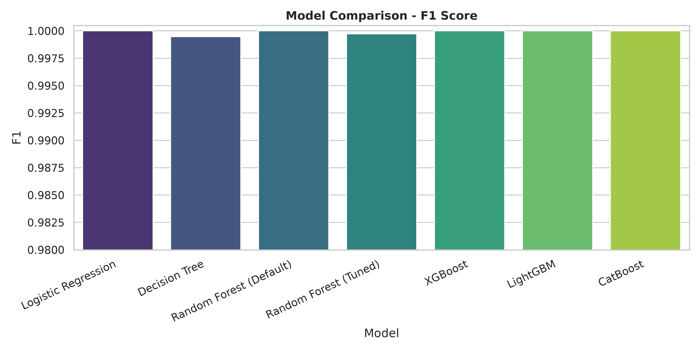
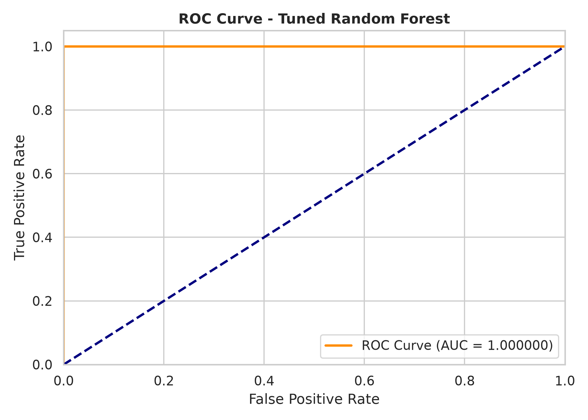
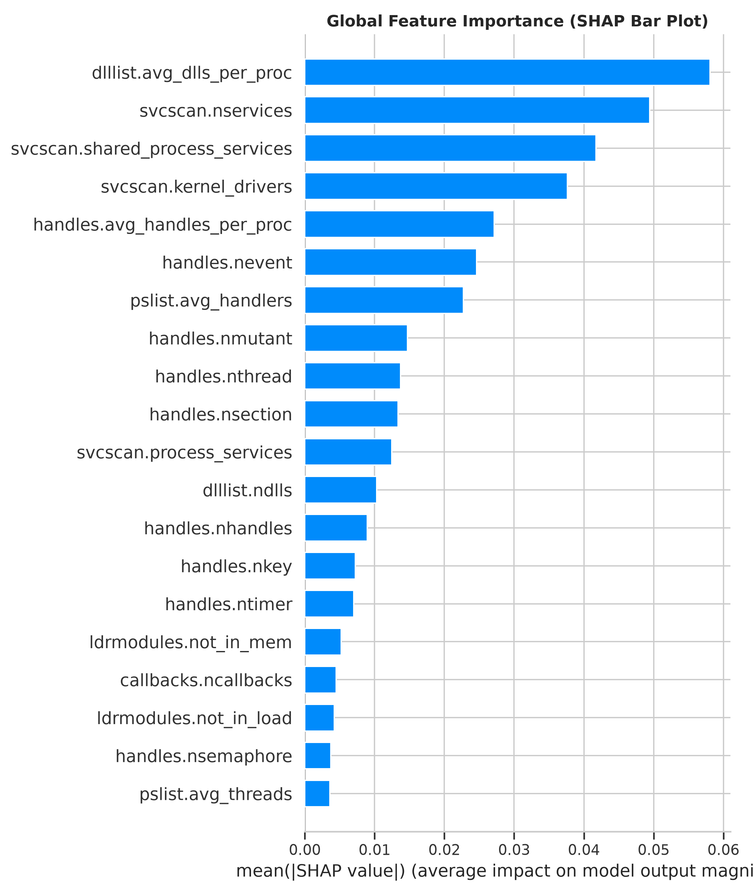
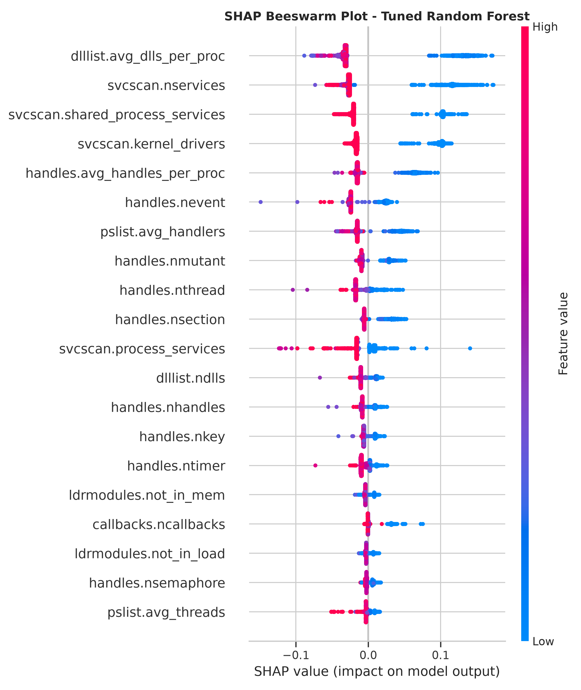
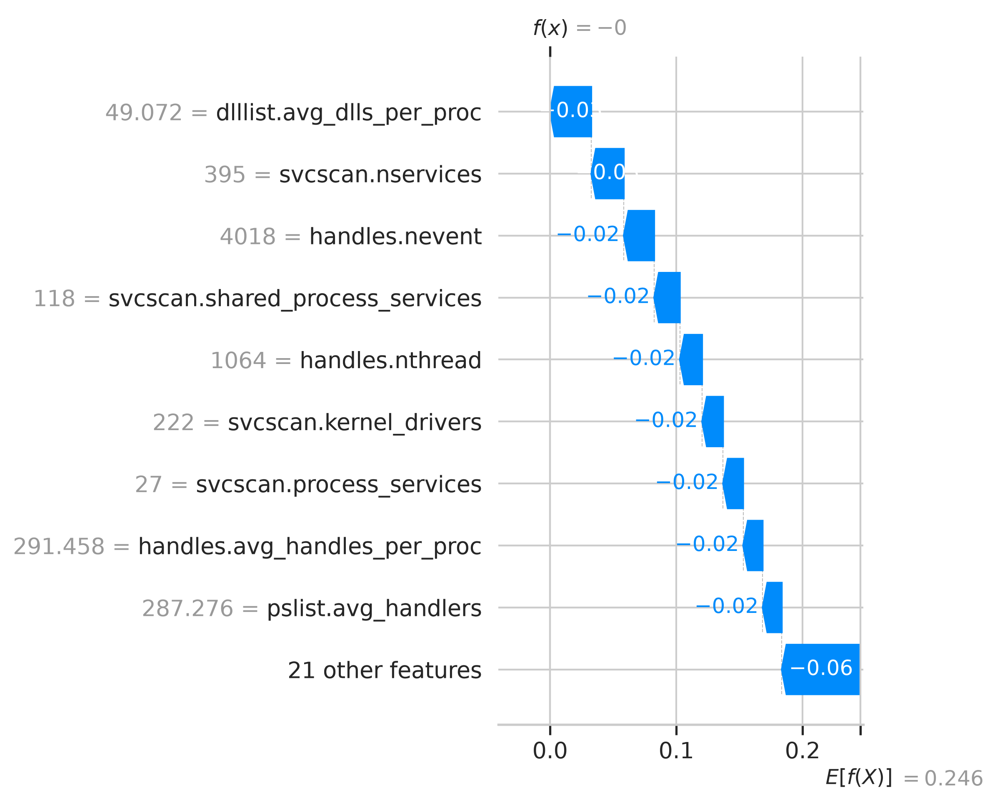
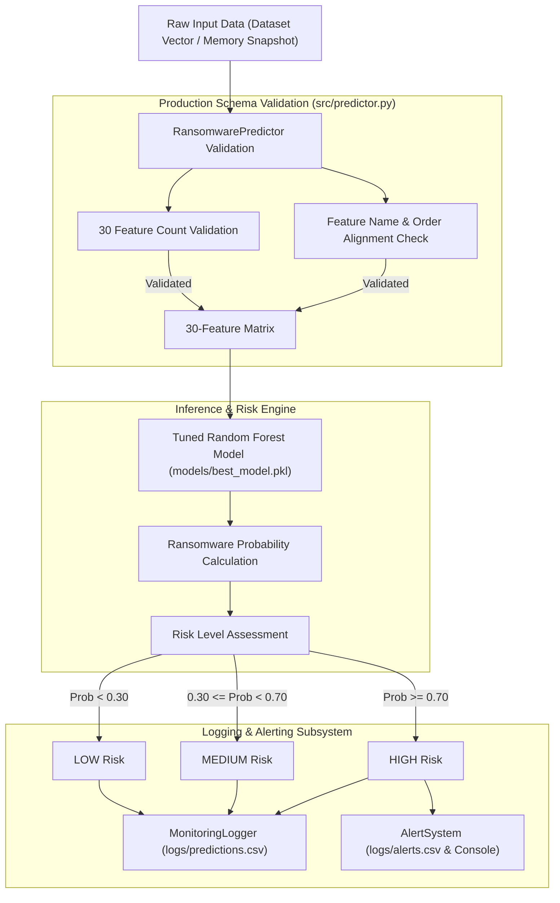

# Ransomware Detection & Real-Time Monitoring System

Production-grade machine learning research and inference pipeline for detecting memory-based ransomware threats using the **CIC-MalMem-2022** dataset, equipped with SHAP explainability, feature validation, alerting, and behavioral telemetry.

---

## 1. Problem Statement
Ransomware attacks pose critical risks to modern enterprise infrastructures. Traditional signature-based detection mechanisms often fail against obfuscated, packed, or novel ransomware variants that execute directly in host memory (fileless or injected attacks). Deep memory forensics provides a robust defense by analyzing running process handles, DLL module linkage, code injection artifacts, and kernel callbacks. However, deploying memory forensic models into production requires strict feature schema validation to prevent training/deployment mismatch.

## 2. Objectives
- **Accurate Memory Forensic Detection**: Evaluate and deploy a high-performance classifier trained on memory forensic features from the CIC-MalMem-2022 dataset.
- **Production-Safe Feature Schema**: Enforce strict 30-feature schema validation (names, order, and count) in `src/predictor.py` to prevent silent misclassifications.
- **Explainable AI (XAI)**: Provide global and local model interpretability using SHAP (SHapley Additive exPlanations).
- **Realistic Monitoring Architecture**: Design a hybrid monitoring framework that distinguishes between user-mode collectable metrics and deep kernel memory dump forensic metrics.
- **Behavioral Telemetry**: Offer a standalone file system (`watchdog`) and resource monitor (`psutil`) to aggregate behavioral telemetry for future research without misapplying memory-trained models.

## 3. Dataset
- **Dataset**: CIC-MalMem-2022 (Obfuscated Malware Memory Dataset)
- **Target**: Binary classification — **Benign** vs **Ransomware**
- **Selected Features**: 30 high-importance memory forensic metrics (reduced from 55 initial columns via univariate feature selection).
- **Feature Categories**: Process list statistics, DLL module linkage, Handle statistics (files, threads, registry keys, semaphores, timers), Volatility stealth module flags (`ldrmodules`), memory code injection indicators (`malfind`), and kernel callbacks (`callbacks`).

## 4. ML Methodology
1. **Preprocessing & Scaling**: Missing value imputation, duplicate removal, feature scaling via `StandardScaler` for linear models.
2. **Feature Selection**: Univariate `SelectKBest` score analysis retaining the top 30 most predictive memory forensic features.
3. **Cross-Validation**: 5-Fold Stratified Cross-Validation (`StratifiedKFold`, `n_splits=5`, `shuffle=True`).
4. **Hyperparameter Tuning**: `RandomizedSearchCV` on Random Forest evaluating 20 parameter combinations over 5 folds.
5. **Evaluation Metrics**: Accuracy, Precision, Recall, F1-Score, ROC-AUC, 5-Fold CV Mean & Standard Deviation, Inference Latency.

## 5. Models Compared
The following 6 machine learning models were evaluated on the 30-feature subset:
1. **Logistic Regression** (with `StandardScaler`)
2. **Decision Tree**
3. **Random Forest (Default)**
4. **Random Forest (Tuned)** (Selected Best Model)
5. **XGBoost**
6. **LightGBM**
7. **CatBoost**

## 6. Results & Model Evaluation
Evaluation on test set and 5-fold cross-validation results:

| Model | Test Accuracy | Test Precision | Test Recall | Test F1-Score | Test ROC-AUC | 5-Fold CV F1 (Mean ± Std) |
|-------|---------------|----------------|-------------|---------------|--------------|---------------------------|
| **Random Forest (Tuned)** | **0.9997** | **0.9995** | **1.0000** | **0.9997** | **0.9999** | **0.999803 ± 0.000262** |
| Random Forest (Default) | 1.0000 | 1.0000 | 1.0000 | 1.0000 | 1.0000 | 0.999803 ± 0.000262 |
| CatBoost | 1.0000 | 1.0000 | 1.0000 | 1.0000 | 1.0000 | 0.999803 ± 0.000262 |
| XGBoost | 1.0000 | 1.0000 | 1.0000 | 1.0000 | 1.0000 | 0.999803 ± 0.000262 |
| LightGBM | 1.0000 | 1.0000 | 1.0000 | 1.0000 | 1.0000 | 0.999541 ± 0.000394 |
| Logistic Regression | 1.0000 | 1.0000 | 1.0000 | 1.0000 | 1.0000 | 0.999410 ± 0.000321 |
| Decision Tree | 0.9995 | 0.9995 | 0.9995 | 0.9995 | 0.9995 | 0.999278 ± 0.000565 |

> **Model Selection Rationale**: The **Tuned Random Forest** (`models/best_model.pkl`) was selected as the final production model due to its optimal balance between near-perfect 5-fold cross-validation stability (F1: 0.999803), robust generalization against overfitting (max_depth=30, min_samples_leaf=2), fast inference speed, and native compatibility with SHAP TreeExplainer.

### Evaluation Visualizations
| Model Comparison | Confusion Matrix | ROC Curve |
| :---: | :---: | :---: |
|  |  |  |

## 7. Explainability (SHAP Analysis)
Global and local model interpretability plots generated for the Tuned Random Forest model:

### Global Feature Importance & Feature Impact
| SHAP Bar Plot | SHAP Beeswarm Plot |
| :---: | :---: |
|  |  |

### Local Waterfall Explanation


**Top 5 Discriminative Features**:
1. `handles.nhandles`: High total handle counts correlate strongly with ransomware encryption routines.
2. `pslist.avg_handlers`: Process handle allocation intensity.
3. `dlllist.ndlls`: Loaded Dynamic Link Libraries count.
4. `ldrmodules.not_in_load`: Unlinked DLL modules in memory (stealth injection indicator).
5. `malfind.commitCharge`: Memory commit charge associated with injected executable regions.

## 8. System Architecture



## 9. Real-Time Monitoring Limitations & Architecture
> [!IMPORTANT]
> **Technical Limitation**: The 30 CIC-MalMem features represent deep memory forensic metrics (`ldrmodules`, `malfind`, `callbacks`, `psxview`, specific handle object counts) extracted from raw RAM memory dumps using Volatility. Standard Windows user-mode APIs (`psutil`) can only collect basic process/thread counts.

- **Safety Enforcement**: The system **never silently substitutes** missing memory features with live file rename or CPU metrics.
- **Monitoring Modes**:
  - `replay`: Replays valid 30-feature vectors through the full prediction, risk scoring, logging, and alerting pipeline.
  - `monitor`: Validates live API feature availability and reports missing memory forensic features.
  - `behavioral-monitor`: Independent module tracking file system (`watchdog`) and CPU/RAM/Disk I/O events.

## 10. Installation

### Prerequisites
- Python 3.10+ (Windows / Linux)

### Setup
```bash
# Clone repository
git clone https://github.com/Monishwaran45/Ransomeware-.git
cd Ransomeware-

# Create and activate virtual environment
python -m venv .venv
.venv\Scripts\activate  # Windows

# Install dependencies
pip install -r requirements.txt
```

## 11. Usage

### Replay Mode (Full Pipeline Test)
Run dataset samples through validation, prediction, risk scoring, logging, and alerting:
```bash
python main.py --mode replay --samples 5
```

### Monitor Mode (Live Memory Feature Compatibility Check)
Inspect user-mode feature availability vs required Volatility memory features:
```bash
python main.py --mode monitor
```

### Behavioral Monitor Mode (Standalone Watchdog & Resource Logger)
Monitor live file modifications, creations, CPU %, and Disk I/O:
```bash
python main.py --mode behavioral-monitor --duration 15
```

## 12. Project Structure
```
Ransomware/
├── config.yaml                       # Application configuration & risk thresholds
├── pyproject.toml                    # Project configuration
├── requirements.txt                  # Python dependencies
├── README.md                         # Technical documentation
├── main.py                           # CLI entry point (--mode replay/monitor/behavioral-monitor)
├── models/
│   ├── best_model.pkl                # Production Tuned Random Forest model
│   ├── feature_names.pkl             # List of exact 30 selected feature names
│   ├── preprocessing_pipeline.pkl    # Pipeline metadata & scaler reference
│   └── random_forest_tuned.pkl       # Tuned Random Forest artifact
├── src/
│   ├── __init__.py
│   └── predictor.py                  # RansomwarePredictor with 30-feature schema validation
├── monitoring/
│   ├── __init__.py
│   ├── monitor_config.py             # Feature taxonomy & collectability catalog
│   ├── process_monitor.py            # User-mode process enumeration via psutil
│   ├── feature_extractor.py          # Feature availability & fallback validator
│   ├── collector.py                  # DataCollector for dataset replay & memory dump adapter
│   ├── logger.py                     # Prediction & alert logger (logs/predictions.csv, logs/alerts.csv)
│   └── alert.py                      # Console alert formatter for high-risk detections
├── behavior_monitoring/
│   ├── __init__.py
│   ├── file_monitor.py               # Watchdog file system observer
│   ├── process_monitor.py            # Process CPU, RAM & Disk I/O sampler
│   └── event_aggregator.py           # Windowed event aggregator (logs/behavioral_events.csv)
├── Notebooks/
│   ├── 01_Data_Collection.ipynb
│   ├── 02_EDA.ipynb
│   ├── 03_Preprocessing_Feature_eng.ipynb
│   ├── 04_Model_training.ipynb
│   ├── 05_Model_Eval.ipynb
│   ├── 06_Hyperparameter.ipynb
│   └── 07_Shapai.ipynb               # SHAP explainability notebook
├── reports/
│   ├── evaluation_report.json        # Detailed model metrics JSON
│   ├── model_comparison.csv          # Evaluation comparison table
│   ├── shap_summary.md               # SHAP feature ranking & interpretation
│   └── figures/                      # Evaluation & SHAP plots (PNG format)
└── logs/                             # CSV runtime logs (git-ignored)
```

## 13. Safety Note
> [!CAUTION]
> **CRITICAL SECURITY NOTE**: This project is developed purely for cybersecurity research, defensive threat detection, and forensic analysis. Do **NOT** use real ransomware binaries or execute live malware samples for testing. All testing must be conducted using static feature replay vectors or safe synthetic event simulators.

## 14. Future Work
1. **Volatility 3 Service Integration**: Implement a background service adapter that automatically triggers a kernel memory acquisition tool upon high-risk behavioral alerts.
2. **Behavioral Model Training**: Train a dedicated secondary classifier on windowed behavioral event logs (`logs/behavioral_events.csv`).
3. **Automated Incident Response**: Add optional configurable process isolation / containment triggers for confirmed high-confidence alerts.
